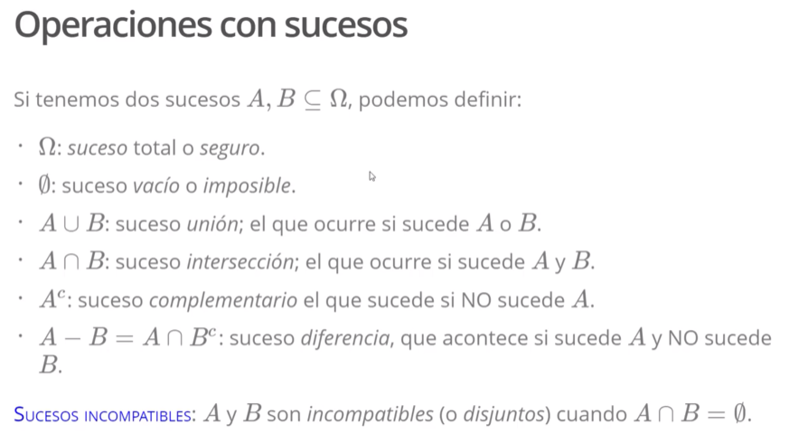
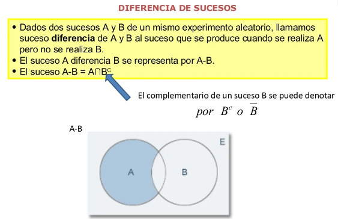
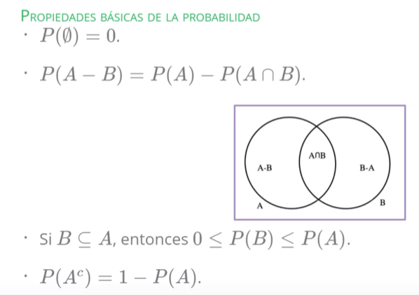
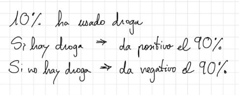

```{r setup, include=FALSE}
knitr::opts_chunk$set(echo = TRUE)
```

## Notas probabilidad

## Definiciones básicas

{width="561"}

{width="285"}

{width="284"}

{width="281"}

{width="290"}



## Probabilidad condicionada

Ejemplos:

1.  Una empresa de telefonía tiene los siguientes clientes

$$
\left.
\begin{array}{ll}
\text{75% 5G}\\
\text{80% Camera HD}
\end{array}
\right \}
\text{65% quiere los dos}
$$

Si elegimos una persona al azar de sus clientes, ¿Cuál es la probabilidad que quieran al menos alguna de las dos cosas?

Definimos los dos sucesos:

$$
\begin{array}{ll}
\text{A = "El cliente quiere 5G"}\\
\text{B = "El cliente quiere camara HD"} 
\end{array}
$$

Conocemos las probabilidades:

```{python}
p_a = .75
p_b = .8
p_a_i_b = .65
```

Por lo tanto queremos:

$$
P(\text{A}\cup\text{B}) = P(\text{A}) + P(\text{B}) - P(\text{A}\cap\text{B}) = 0.75 + 0.8 - 0.65 = 0.9
$$

```{python}
p_a + p_b - p_a_i_b
```

El 90% de nuestros clientes quieren como mínimo una de las funcionalidades.

¿Cuál sería la probabilidad que una persona que quiere el 5G, cuál es la probabilidad que quiera la cámara en HD, y una persona que quiere la cámara quiera también el 5G?

Estas son probabilidades condicionadas:

$$
P(\text{B}\mid\text{A}) = \frac{P(\text{A}\cap\text{B})}{P(\text{A})} = \frac{0.65}{0.75} = .86
\\
P(\text{A}\mid\text{B}) = \frac{P(\text{A}\cap\text{B})}{P(\text{B})} = \frac{0.65}{0.8} = .81
$$

```{python}
p_a_i_b / p_a
p_a_i_b / p_b
```

## Fórmula de Bayes

Teorema de Bayes

Sean A y B dos sucesos. Si $P(B) > 0$, entonces

$$
P(A \mid B) = \frac{P(A) * P(A \mid B)}{P(B)} = \frac{P(A) * P(B \mid A)}{P(A) * P(B \mid A) + P(A^c) * P(B \mid A^c)}
$$

#### Ejemplo:

Uso de drogas en los deportes.

¿Qué tan bueno sería castigar a los atletas que han dado positivo en el test de drogas?

{width="313"}

Queremos estar seguros antes de culpar a una persona no culpable de que ha tomado drogar.

Para ello lo primero que tenemos que hacer es definir los eventos que corresponden al espacio muestral:

-   $D_{1}$ : usa drogas

-   $D_{2}$ : no usa drogas

-   $T_{1}$ : test de positivo

-   $T_{2}$ : test da negativo

$$
\overline{C}
$$
