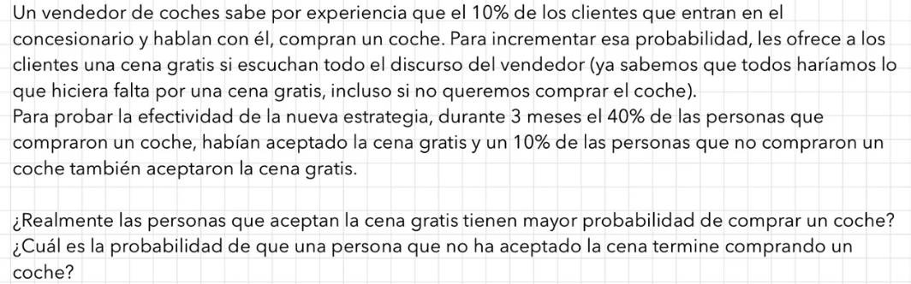

```{r setup, include=FALSE}
knitr::opts_chunk$set(echo = TRUE)
```



Definimos los sucesos:

-   $P : \text{cliente que compra coche}$
-   $noP : \text{cliente que no compra coche}$
-   $C : \text{cliente que acepta cena}$
-   $noC : \text{cliente que no acepta cena}$

¿Qué sabemos?

-   $P(P) = 0.1$
-   $P(noP) = 0.9$
-   $P(C \mid P) = 0.4$
-   $P(noC \mid P) = 0.6\rightarrow\text{Falso Positivo}$
-   $P(C \mid noP) = 0.1\rightarrow\text{Falso Negativo}$
-   $P(noC \mid noP) = 0.9$

Vamos a encontrar las probabilidades conjuntas:

-   La probabilidad que un cliente que haya comprado un coche haya aceptado una cena:

$$
P(P \cap C) = P(C \mid P) * P(P)
$$

```{python}
0.4 * 0.1
```

-   La probabilidad que un cliente que haya comprado un coche y no haya aceptado una cena:

    $$
    P(P \cap noC) = P(noC \mid P) * P(P)
    $$

```{python}
0.6 * 0.1
```

-   La probabilidad que un cliente acepte una cena y no compre un coche:

    $$
    P(noP \cap C) = P(C \mid noP) * P(noP)
    $$

```{python}
0.6*0.1
```

-   Probabilidad que un cliente no acepte una cena y no compre un coche:

    $$
    P(noP \cap noC) = P(noC \mid noP) * P(noP)
    $$

```{python}
0.9 * 0.9
```

|       | $P$  | $noP$ | Total |
|-------|------|-------|-------|
| $C$   | 0.04 | 0.09  | 0.13  |
| $noC$ | 0.06 | 0.81  | 0.87  |
| Total | 0.1  | 0.9   | 1     |

: Pregunta 1:

En base al enunciado del vídeo, ¿Las personas que aceptan la cena tienen mayor probabilidad de comprar el coche?

$$
P(P \mid C) > P(P)\\
P(P \mid C) = \frac{P(P \cap C)}{P(P \cap C) + P(noP \cap C)} = \frac{0.04}{0.04 + 0.09} = 0.0.308
$$

```{python}
round((0.04) / (0.04 + 0.09), 3)
```

La probabilidad de compra es significativamente más alta que un 10%.

## Pregunta 2:

En base al enunciado del vídeo, ¿Cuál es la probabilidad de que una persona que no acepta la cena termina comprando el coche?

$$
P(noC \cap P) = \frac{P(P \cap noC)}{P(P \cap noC) + P(noP \cap noD)} = \frac{0.06}{0.06 + 0.81} = 0.069
$$

```{python}
round(0.06 / (0.06 + 0.81), 3)
```

La probabilidad que un cliente compre un coche no aceptando la cena es mas baja qu ecomprando un coche habiendo aceptado una cena. 